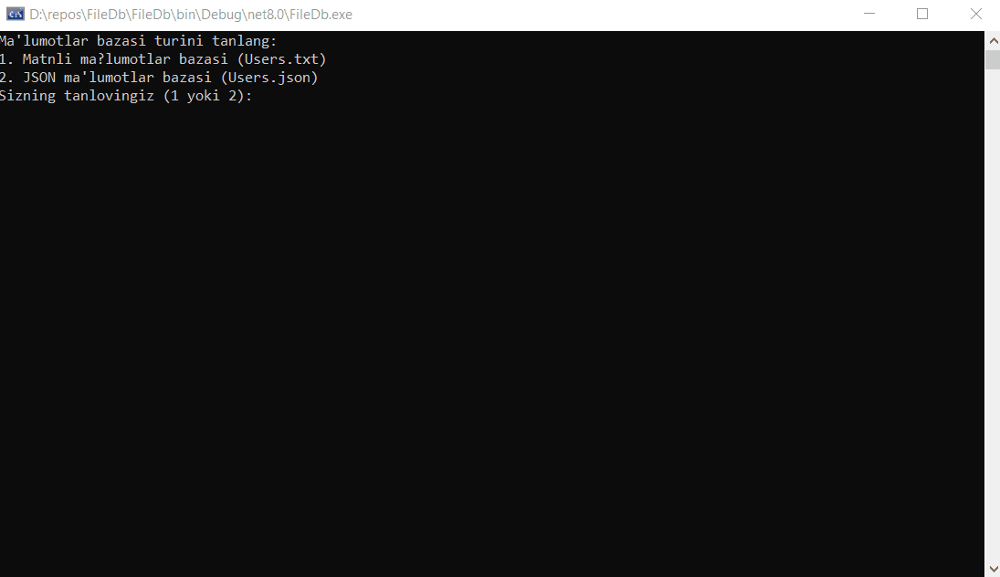

## In this project we can write data to JSON and .TXT files

## In our project
### Assets;
.txt
.json
### Brokers;
Logging
Storage
### Models;
User
### Services;
Identityes
Processing
Service
## has sections
## DEMO .txt

## DEMO .json

